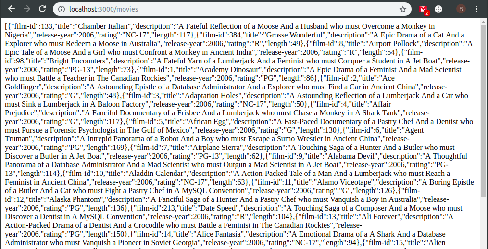
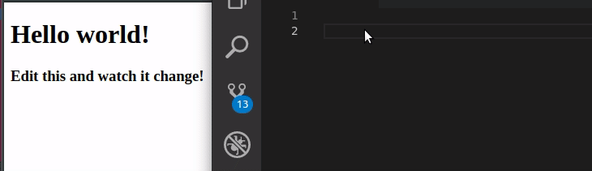
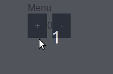
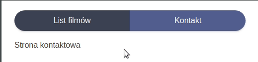
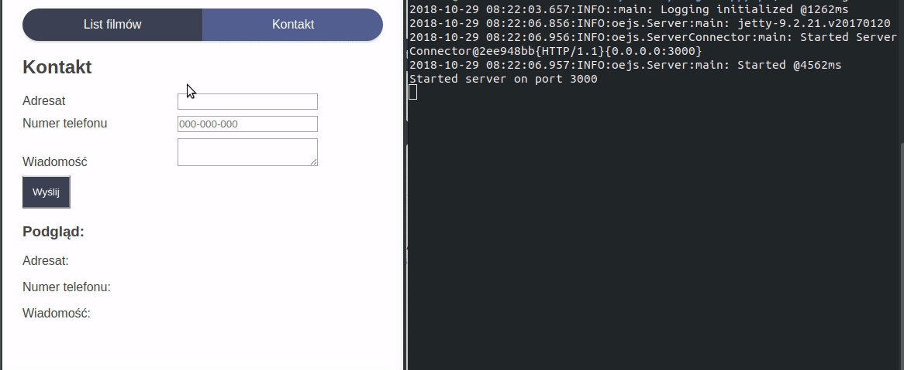

# Aplikacja internetowa w Clojure(Script)
*Niniejszy dokument prezentuje kolejne kroki w tworzeniu aplikacji internetowej z wykorzystaniem języka Clojure i ClojureScript. Aplikacja składa się z: frontendu napisanego za pomocą biblioteki Rum (wrapper ReactJS dla CLJS) i bibliotek pomocniczych, oraz backendu w formie REST Api. Strona internetowa składa się z: widoku listy filmów, które można filtrować i grupować, oraz strony z formularzem kontaktowym. Backend ma za zadanie obsłużyć zapytania po jednej dla każdej ze stron - pobranie danych o filmach oraz wysłanie wiadomości przez formularz kontaktowy*

*Do pełnego zrozumienia treści przedstawionej w artykule konieczna jest podstawowa znajomość terminologii i zasad działania ReactJS oraz REST Api.*

## Kody źródłowe

https://github.com/rilek/clojure-demo-app

## Wymagania
Do wykonania projektu konieczne jest zainstalowanie oprogramowania:
 - Leiningen ([Link]("https://leiningen.org/"))
 - PostgreSQL ([Link]("https://www.postgresql.org/"))

Projekt powinien dobrze działać na dystrybucjach Linuxa oraz macOS. Nie ma gwarancji działania na Windowsie.

Wykorzystano również przykładową bazę danych DVDRental ([Link](http://www.postgresqltutorial.com/postgresql-sample-database/)).

## Uruchomienie projektu
```sh
# REST Api
cd api && lein ring server

# Frontend
cd frontend && lein figwheel

# SCSS Watcher & compiler
cd frontend && lein scss :develop
```

## REPL
Po zainstalowaniu Leningen możliwe jest uruchomienie środowiska interaktywnego w terminalu za pomocą komendy: `lein repl`. Linie kodu w kolejnym rozdziale zaczynające się od `user=>` można uruchomić w środowisku i sprawidzić efekt. `  #_=> ` oznacza ciąg dalszy instrukcji powyżej. Wspomnianych prefixów się nie wpisuje do linii poleceń.

## Parę słów o składni Clojure
Clojure to funkcyjny język programowania stworzy przez Richa Hickeya. Język jest dialektem Lispa z którym dzieli między innymi składnię. Oznacza to ogrom nawiasów, które przy pierwszej styczności są zupełnie nieczytelne, żeby po chwili przyzwyczajenia być jedną z najprzyjemniejszych i najpraktyczniejszych wśród języków programowania. Zasadniczą zależy w porównaniu do innych składni jest jej czytelność i jednoznaczność. Ze względu na swoją specyfikę (wszystko jest listą), korzysta się tutaj z tzw. "odwróconej notacji polskiej", czyli wywołanie funkcji jest listą, gdzie jej pierwszym elementem jest sama funkcja, a kolejnymi argumenty, np:
```javascript
// Javascript
2 + 3 * 4 + 5
19
```

```clojure
;; Clojure
user=> (+ 2 (* 3 4) 5)
19
```

W Clojure istnieją stałe, oraz atomy - nie ma zmiennych działająch w sposób znany z innych języków programowania. Atomy są to typy referencyjne, które, po przyjęciu pewnych uproszczeń, można traktować jako zmienne. Zasadniczą różnicą jest fakt, że zmiana wartości odbywa się poprzez wywołanie odpowienich funkcji, a nie jedynie przypisanie. Atomy pozwalają na zarządzanie stanem w sposób synchroniczny i niezależny, co ma znaczenia w przypadku programów wielowątkowych, które nie wchodzą w zakres niniejszego poradnika. Stworzenie atomu odbywa się poprzez wywałanie funkcji `atom`.
### Przypisanie wartości do nazw
Przypisanie wartości może obywać się albo w danej przestrzeni nazw
```clojure
user=> (def x 1)
#'user/x
user=> x
1
```
albo tworząc zakres lokalny - o czym za chwilę.

### Atomy
Atomy tworzy się poprzez przypisanie do nazwy wartości zwracanej przez funkcję atom. Jej argumentem jest początkowa wartość atomu. Zmiana wartości odbywa się poprzez przypisanie (funkcja `reset!`), bądź zmianę (funkcja `swap!`). Dostęp do jego wartości uzyskać można dodając znak `@` przed nazwą.

```clojure
;; definiowanie
user=> (def x (atom nil))
#'user/x
user=> x
#object[clojure.lang.Atom 0x14c21098 {:status :ready, :val nil}]

;; przypisanie wartości
user=> (reset! x 10)
10
user=> x
#object[clojure.lang.Atom 0x14c21098 {:status :ready, :val 10}]
user=> @x
10

;; zmiana
user=> (swap! x + 10)
20
```
Na powyższym przykładzie widać, że funkcja `reset!` przyjmuje jako argumenty atom oraz wartość do przypisania, natomiast `swap!` atom, funkcję zmieniającą, oraz kolejne parametry funkcji zmieniającej. Ostatni przykład jest równoważny z poniższym:
```clojure
user=> (reset! x (+ @x 10))
20
```

### Zakres lokalny
```clojure
user=> (let [z 1]
#_=>     z)
1
user=> (let [z 10]
         (* z 100)
#_=>     (+ z 10))
20
user=> z
CompilerException java.lang.RuntimeException: Unable to resolve symbol: z in this context, compiling:(/tmp/form-init1150485929264120195.clj:1:1282)
user=> x
```
Zakres lokalny pozwala na lokalne zdefiniowane stałych. Zwraca on wartość ostatniej operacji. Zakres tworzony jest poprzez słowo kluczone `let`. Następnie, w nawiasach kwadratowych, definiowane są stałe, a po nich występują instrukcje.

### Struktury danych

Wykorzystywane w projekcie struktury to głównie prymitywy, wektory oraz tablice asocjacyjne (hash-mapy).

```clojure
;; prymitiwy
1 -1 "asd" 1.23 10e10

;; wektory
[] (vec) (vector 10 1 01)

;; hash-map
{:a 1 "b" 2}
```

Dostęp do konkretnych elementów wektora można uzyskać między innymi za pomocą funkcji `nth`. Argumentami są kolejno: struktura oraz nty element. Numeracja zaczyna się od zera.

```clojure
user=> (def x [1 2 3])
#'user/x
user=> (nth x 2)
3
```

Mapy zawierają pary `klucz wartość`. Pierwszym może być albo string, liczba bądź keyword - specjalna wartość poprzedzona znakiem dwukropka `:`. Jeśli klucz nie jest instancją `key`, dostęp do wartości wymaga użycia funkcji `get`. W przeciwnym razie można wykorzystać klucz jako funkcję.

```clojure
user=> (def x {:a 1 "b" 2})
#'user/x
user=> (:a x)
1
user=> (get x "b")
2
```

W Clojure zaimplementowano destrukturyzację map i wektorów. Pierwszy wariant przedstawia destrukturyzację, gdzie klucz zostaje stałą o tej samej nazwy (poza znkaiem `:` oczywiście). Opcja druga pozwala pobranie kluczy i zmianę nazwy. Ostatni przykład przedstawia listę, z której pobierane są pierwszy i trzeci element, a drugi i wszystkie po 4 sa ignorowane. Wykorzystanie poniżej.

```clojure
user=> (def x {:foo 1 :bar 2 :buzz 3})
user=> (let [{:keys [foo bar buzz]} x]
#_=>     [foo bar buzz])
[1 2 3]
user=> (let [{f :foo b :bar bz :buzz}]
#_=>       [f b bz])
[1 2 3]
user=> (let [[foo _ bar] [1 2 3 4 5 6 7]]
#_=>     [foo bar])
[1 3]
```

### Funkcje

Funkcje, podobnie jak zakresy, zwracają jedynie wartość ostatniej operacji. Clojure pozwala na przysłanianie oraz dynamiczną liczbe parametrów. Można je definiować w formie nazwanej jak i anonimowej. Drugi przypadek posiada nienazwane argumenty - są one reprezentowane poprzez znak `%`. W przypadku wielu argumentów drugi to `%2` itd. Sama jej definicja to `#`, po którym występują nawiasy, w których umieszcozne są instrukcje. Definicja w danym zakresie nazw polega na wywołaniu `defn`, po którym występuje nazwa, argumenty w nawiasach kwadratowych, a następnie instrukcje.

```clojure
;; funkcja nazwana
(defn funkcja [arg1 arg2]
  (+ arg1 arg2))

;; analogiczna funkcja anonimowa
(def funkcja2 #(+ %1 %2))
```

Clojure posiada makro ` ->` (`thread-frist`) pozwala na pisanie czytelniejszego kodu poprzez pozbycie się zagnieżdżeń wywołania funkcji. Działa w ten sposób, że pierwszy parametr jest przekazywany do późniejszych funkcji również jako pierwszy parametr. Poniższy przykład działa w następujący sposób:

- Z podanej mapy zwracana jest wartość pod kluczem `:a` -> `"Hello World"`
- String podzielony jest na podstawie spacji -  `#""`  w Clojure oznacza Regex Pattern -> `["Hello" "World"]`
- Pobierany jest pierwszy element listy -> `"Hello"`
- String łączony jest ze stringiem " You" -> `"Hello You"`

```clojure
user=> (-> {:a "Hello World"}
#_=>    :a
#_=>    (clojure.string/split #" ")
#_=>    first
#_=>    (str " You"))
"Hello You"
```

Istnieje również wariacja makra - `thread-last`( `->>`), które argument do funkcji przypisuje jako ostatni

## REST Api

### Przygotowanie projektu
Do stworzenia szkieletu api wykorzystamy Leiningena. Taka generyczna aplikacja korzysta z `ring` jak serwera, oraz biblioteki `compojure` do routingu.
```sh
> lein new compojure api && cd api
```
Wygenerowany projekt ma następującą strukturę:
```
.
├── project.clj
├── README.md
├── resources
│   └── public
├── src
│   └── api
│       └── handler.clj
└── test
    └── api
        └── handler_test.clj
```
 - `project.clj` - jest plikiem konfiguracyjnym projektu. Są zawarte w nim informacje, zależności, pluginy i konfiguracje buildów.

 - `src/api/handler.clj` - kod źródłowy naszej aplikacji.

  Pozostałe foldery/pliki nie mają znaczenia w realizacji projektu.

### Uruchomienie
Serwer domyślnie działa na porcie 3000. Uruchomić go można komendą:
```clojure
lein ring server
```
Po pobraniu zależności i uruchomieniu, w domyślnej przeglądarce powinna się otworzyć karta z napisem `Hello World`. Możemy przystąpić do edycji!

### project.clj
Wygenerowany plik ma postać:
```clojure
(defproject api "0.1.0-SNAPSHOT"
  :description "FIXME: write description"
  :url "http://example.com/FIXME"
  :min-lein-version "2.0.0"
  :dependencies [[org.clojure/clojure "1.9.0"]
                 [compojure "1.6.1"]
                 [ring/ring-defaults "0.3.2"]]
  :plugins [[lein-ring "0.12.4"]]
  :ring {:handler api.handler/app}
  :profiles
  {:dev {:dependencies [[javax.servlet/servlet-api "2.5"]
                        [ring/ring-mock "0.3.2"]]}})

```
Fragment, który będzie nas interesował znajduje się pod kluczem `:dependencies`. Należy dodać kolejne zależności:
```clojure
  :dependencies [[org.clojure/clojure "1.9.0"]
                 [compojure "1.6.1"]
                 [ring/ring-json "0.4.0"]
                 [ring/ring-defaults "0.3.2"]
                 [ring-cors "0.1.12"]
                 [org.postgresql/postgresql "42.1.4"]
                 [oksql "1.2.1"]]
```
### src/api/handler.clj
Kolejny edytowanym plikiem jest `./src/api/handler.clj`. Można go podzielić na 3 części. Pierwsza część zawiera definicję przestrzeni nazw - w tym wypadku `api.handler`, oraz zależności - po `:require`. Środek programu składa się z definicji ścieżek. Jak widać dla domyślnej aplikacji obsługujemy jedynie ścieżkę główną, a każdy inny zwraca `Not found`.
```clojure
;; namespace, zależności
(ns api.handler
  (:require [compojure.core :refer :all]
            [compojure.route :as route]
            [ring.middleware.defaults :refer [wrap-defaults site-defaults]]))
```
```clojure
(defroutes app-routes
  (GET "/" [] "Hello World")
  (route/not-found "Not Found"))
```
```clojure
(def app
  (wrap-defaults app-routes site-defaults))
```
Ostatni listing ma za zadanie uruchomić serwer dla zdefiniowanych ścieżek.

Nasza aplikacja będzie obsługiwać 2 zapytania HTTP.
 - `POST /contact` - obsługa formularza kontaktowego, który przygotujemy po stronie frontendu. Jego funkcjonalność będzie ograniczać się jedynie do przyjęcia danych i wyświetlenia ich w terminalu.
 - `GET /movies` - zapytanie to będzie zwracać listę filmów pobraną z bazy danych.

Zanim jednak przystąpimy do napisania kodu obsługującego wspomniane zapytania, musimy zaktualizować zależności:
```clojure
(ns api.handler
  (:require [compojure.core :refer :all]
            [compojure.route :as route]
            [compojure.handler :as handler]
            [ring.middleware.json :as middleware]
            [ring.middleware.cors :refer [wrap-cors]]
            [oksql.core :as oksql]))
```

#### GET /movies
Aby zwrócić listę filmów, konieczne jest pierw pobranie ich z bazy. Z pomocą przychodzi nam biblioteka `oksql`. Pozwala ona na obsługę zapytań SQL do bazy danych postgreSQL. Pierwszym krokiem jest dodanie pliku z zapytaniem. W tym celu należy stworzyć katalog `resources/sql`, a w nim dodać plik `film.sql`. Komentarze są ważne, ponieważ późniejsze odwołanie do zapytania ma postać `:{nazwa-pliku}/{name}`, czyli w naszym przypadku `:film/all`:
```sql
-- film.sql

-- name: all
select film_id, title, description, release_year, rating, length
from film
limit 50
```
Po stworzeniu pliku z zapytaniem wracamy do `api.handler`, gdzie dodajemy kod odpowiedzialny za połączenie z bazą danych, obsługę zapytania SQL oraz HTTP:
```clojure
(def db {:connection-uri "jdbc:postgresql://localhost:5432/dvdrental"})

(def query (partial oksql/query db))

(defn all []
  "Fetch 50 movies"
  (query :film/all))

(defroutes app-routes
  (GET "/movies" [] (all))
  (route/not-found "Not Found"))
```

Z PostgreSQL zwracany będzie JSON, więc konieczne jest dodanie middleware, które go obsłuży. Chcemy również pozbyć się problemów związanych CORS, więc użyty zostanie kolejny middleware. Url podany w `:access-control-allow-origin` jest to domyślny adres frontendu, który za moment stworzymy. Oczywiście można go dowolnie modyfikować:

```clojure
(def app
  (-> (handler/api (wrap-cors app-routes
                              :access-control-allow-origin [#"http://localhost:3449"]
                              :access-control-allow-methods [:get :post]))
      (middleware/wrap-json-body)
      (middleware/wrap-json-response)))
```
Nasz kod przetestować możemy uruchamiając serwer i uruchamiając w przeglądarce adres naszego API z odpowiednim URI `http://localhost:3000/movies`, bądź w terminalu z pomocą *curl*: `curl -X GET http://localhost:3000/movies`.



#### POST /contact
Request ma jedynie wyświetlać w konsoli przesłań doń dane. Należy napisać funkcję, która przyjmie zapytanie jako argument, oraz dodać kolejny *route*:
```clojure

(defn handle-contact [req]
  (println "KONTAKT" (:params req))
  "Dziękujemy za kontakt!")

(defroutes app-routes
  (GET "/movies" [] (all))
  (POST "/contact" request (handle-contact request))
  (route/not-found "Not Found"))
```
Ze względu na fakt, że jest to zapytanie POST, odpada możliwość testowania w przeglądarce. Możemy użyć albo *curl*: ` curl -X POST -d 'klucz=wartosc' -H 'application/x-www-form-urlencoded' http://localhost:3000/contact`, albo innego oprogramowania (np. *Postman*).

2 działające requesty to wszystko co potrzebowaliśmy do naszej aplikacji - przechodzimy więc do frontendu!

## Frontend
### Przygotowanie aplikacji
*W ramach tego rozdziału przygotowana zostanie aplikacja frontendowa komunikująca się z api z poprzedniego rozdziału. Aplikacja będzie działać w formie SPA, w związku z tym przygotowany musi zostać routing. Do stylowania wykorzystamy SCSS, które zintegrowany zostanie z "hot loadingiem", dzięki czemu wszystkie zmiany stylów automatycznie pojawią się na stronie.
Stworzone zostaną 2 podstony - główna z lista filmów, oraz formularz kontaktowy, które skorzystają ze stworzonych już endpointów. Interfejs będzie stworzony za pomocją biblioteki `Rum`, który jest wrapperem dla `ReactJS` w ClojureScript. Jako silnik template służyć będzie `Hiccup`. Stan aplikacji zarządzany będzie przez bibliotekę `Citrus`, która została dopasowana do naszego frameworka.*

Wracamy do katalogu powyżej naszego api, a następnie tworzymy szkielet aplikacji frontendowej:
```sh
lein new figwheel frontend -- --rum && cd frontend
```
Uruchomić ją możemy za pomocą komendy `lein figwheel`. Po odpaleniu projektu, w domyślnej przeglądarce powinna się otworzyć nowa zakładka o adresie `localhost:3449/index.html`. Na stronie powinien się znaleźć klasyczny "Hello World!" oraz sugestia do wprowadzenia zmian w kodzie.

Serwer figwheel ma wiele zalet. Poza szybkością (pliki są trzymane w pamięci podręcznej, więc czas dostępu jest bardzo mały), pracę bardzo usprawnia tzw. "hot reloading", czyli po wprowadzeniu zmian w kodzie i zapisaniu pliku, serwer automatycznie aktualizuje stronę otwartą w przeglądarce.


Katalog całego projektu powinien mieć obecnie strukturę:
```
.
├── dev
│   └── user.clj
├── project.clj
├── README.md
├── resources
│   └── public
│       ├── css
│       ├── index.html
│       └── js
├── src
│   └── frontend
│       └── core.cljs
└── target
```

- `dev/user.clj` - kod zawarty w pliku odpowiada za start i zatrzymanie serwera figwheel w tym REPL,
- `README.md` - podstawowe informacje o uruchomieniu i budowaniu projektu,
- `resources/public` - pliki publiczne zawierające index.html, pliki css oraz js - w tym nasza aplikacja ClojureScript skompilowana do JavaScriptu,
- `src` - pliki z Clojuresciptem aplikacji. Folder i nazwa pliku determinują namespace - dla naszego przypadku jest to `frontend.core`,
- `target` - folder z plikami wynikowymi po zbudowaniu projektu,
- `project.clj` - plik konfiguracyjny o zastosowaniu analogicznym jak dla REST API.

### ./project.clj
Generyczny plik ma postać:

```clojure
(defproject frontend "0.1.0-SNAPSHOT"
  :description "FIXME: write this!"
  :url "http://example.com/FIXME"
  :license {:name "Eclipse Public License"
            :url "http://www.eclipse.org/legal/epl-v10.html"}


  :min-lein-version "2.7.1"

  :dependencies [[org.clojure/clojure "1.9.0"]
                 [org.clojure/clojurescript "1.10.238"]
                 [org.clojure/core.async  "0.4.474"]
                 [rum "0.11.2"]]

  :plugins [[lein-figwheel "0.5.16"]
            [lein-cljsbuild "1.1.7" :exclusions [[org.clojure/clojure]]]]

  :source-paths ["src"]

  :cljsbuild {:builds
              [{:id "dev"
                :source-paths ["src"]

                ;; The presence of a :figwheel configuration here
                ;; will cause figwheel to inject the figwheel client
                ;; into your build
                :figwheel {:on-jsload "frontend.core/on-js-reload"
                           ;; :open-urls will pop open your application
                           ;; in the default browser once Figwheel has
                           ;; started and compiled your application.
                           ;; Comment this out once it no longer serves you.
                           :open-urls ["http://localhost:3449/index.html"]}

                :compiler {:main frontend.core
                           :asset-path "js/compiled/out"
                           :output-to "resources/public/js/compiled/frontend.js"
                           :output-dir "resources/public/js/compiled/out"
                           :source-map-timestamp true
                           ;; To console.log CLJS data-structures make sure you enable devtools in Chrome
                           ;; https://github.com/binaryage/cljs-devtools
                           :preloads [devtools.preload]}}
               ;; This next build is a compressed minified build for
               ;; production. You can build this with:
               ;; lein cljsbuild once min
               {:id "min"
                :source-paths ["src"]
                :compiler {:output-to "resources/public/js/compiled/frontend.js"
                           :main frontend.core
                           :optimizations :advanced
                           :pretty-print false}}]}

  :figwheel {;; :http-server-root "public" ;; default and assumes "resources"
             ;; :server-port 3449 ;; default
             ;; :server-ip "127.0.0.1"

             :css-dirs ["resources/public/css"] ;; watch and update CSS

             ;; Start an nREPL server into the running figwheel process
             ;; :nrepl-port 7888

             ;; Server Ring Handler (optional)
             ;; if you want to embed a ring handler into the figwheel http-kit
             ;; server, this is for simple ring servers, if this

             ;; doesn't work for you just run your own server :) (see lein-ring)

             ;; :ring-handler hello_world.server/handler

             ;; To be able to open files in your editor from the heads up display
             ;; you will need to put a script on your path.
             ;; that script will have to take a file path and a line number
             ;; ie. in  ~/bin/myfile-opener
             ;; #! /bin/sh
             ;; emacsclient -n +$2 $1
             ;;
             ;; :open-file-command "myfile-opener"

             ;; if you are using emacsclient you can just use
             ;; :open-file-command "emacsclient"

             ;; if you want to disable the REPL
             ;; :repl false

             ;; to configure a different figwheel logfile path
             ;; :server-logfile "tmp/logs/figwheel-logfile.log"

             ;; to pipe all the output to the repl
             ;; :server-logfile false
             }


  ;; Setting up nREPL for Figwheel and ClojureScript dev
  ;; Please see:
  ;; https://github.com/bhauman/lein-figwheel/wiki/Using-the-Figwheel-REPL-within-NRepl
  :profiles {:dev {:dependencies [[binaryage/devtools "0.9.9"]
                                  [figwheel-sidecar "0.5.16"]
                                  [cider/piggieback "0.3.1"]]
                   ;; need to add dev source path here to get user.clj loaded
                   :source-paths ["src" "dev"]
                   ;; for CIDER
                   ;; :plugins [[cider/cider-nrepl "0.12.0"]]
                   :repl-options {:nrepl-middleware [cider.piggieback/wrap-cljs-repl]}
                   ;; need to add the compliled assets to the :clean-targets
                   :clean-targets ^{:protect false} ["resources/public/js/compiled"
                                                     :target-path]}})
```

Ze względu na skomplikowanie pliku, omówione zostaną tylko interesujące nas klucze, wraz z modyfikacjami ich wartości, które należy skopiować do swojego pliku:
- `:dependencies` - lista zależności - analogicznie jak w przypadku api dodanie kolejnego elementu spowoduje pobranie paczki przy kolejnym uruchomieniu projektu. Dodajemy kolejne biblioteki:
```clojure
  :dependencies [[org.clojure/clojure "1.9.0"]
                 [org.clojure/clojurescript "1.10.238"]
                 [org.clojure/core.async "0.2.395"
                  :exclusions [org.clojure/tools.reader]]
                 [rum "0.11.2" :exclusions [cljsjs/react]]
                 [org.roman01la/citrus "3.2.0"]
                 [cljs-http "0.1.45"]
                 [funcool/bide "1.6.0"]
                 [cljsjs/react "16.3.0-1"]
                 [cljsjs/react-dom "16.3.0-1"]
                 [ring "1.4.0"]
                 [ring/ring-defaults "0.2.0"]
                 [compojure "1.6.1"]]
```
- `:plugins` - jak sama nazwa wskazuje - lista z pluginami.
```clojure
  :plugins [[lein-figwheel "0.5.16"]
            [lein-cljsbuild "1.1.7" :exclusions [[org.clojure/clojure]]]
            [lein-scss "0.3.0"]
            [lein-ring "0.12.4"]]
```
- ':scss' - nowy klucz, którego wartością jest konfiguracja obsługi SCSS.
```clojure
  :scss {:builds {:develop {:source-dir "statics/scss/" :dest-dir "resources/public/css/" :executable "sassc" :args ["-I" "statics/scss/styles.scss"]}}}
```
- `:cljsbuild` - konfiguracja buildów. Ponieważ w ramach tego poradnika nie będziemy przygotowywać aplikacji do produkcyjnego działania, interesować nas będzie tylko build o id `dev`.
  - `:figwheel` - konieczne jest dodanie znaku slash `/` do `:asset-path`, aby zapytania o pliki zawsze odwoływały się katalogu głównego.
```clojure
               {:id "dev"
                :source-paths ["src"]

                ;; The presence of a :figwheel configuration here
                ;; will cause figwheel to inject the figwheel client
                ;; into your build
                :figwheel {:on-jsload "frontend.core/on-js-reload"
                           ;; :open-urls will pop open your application
                           ;; in the default browser once Figwheel has
                           ;; started and compiled your application.
                           ;; Comment this out once it no longer serves you.
                           :open-urls ["http://localhost:3449/"]}

                :compiler {:main frontend.core
                           :pretty-print true
                           :asset-path "/js/compiled/out"
                           :output-to "resources/public/js/compiled/frontend.js"
                           :output-dir "resources/public/js/compiled/out"
                           :source-map-timestamp true
                           ;; To console.log CLJS data-structures make sure you enable devtools in Chrome
                           ;; https://github.com/binaryage/cljs-devtools
                           :preloads [devtools.preload]}}
```
 - `:figwheel` - konfiguracja serwera figwheel. Aplikacja ma działać bez przeładowania, chcemy aby niezależnie od ścieżki serwer odwoływał się do pliku `index.html`, a samo przejście pomiędzy podstronami obsługiwać będziemy po stronie klienta (ClojureScriptu). W związku z tym musimy zmodyfikować konfigurację i wykorzystać własny serwer ring, za który odpowiada pozycja `:ring-handler`. `core.server/dev-app` jest funkcją, którą stworzymy za moment.
 ```clojure
  :figwheel {:http-server-root "public" ;; default and assumes "resources"
             :server-port 3449 ;; default
             :server-ip "127.0.0.1"

             :ring-handler core.server/dev-app
             :css-dirs ["resources/public/css"]} ;; watch and update CSS
 ```
### Obsługa SCSS
Zgodnie z konfiguracją plik `styles.scss` powinien się znaleźć w folderze `statics/scss`. Tworzymy więc `mkdir statics/scss && cd statics/scss`. W nim konieczne jest stworzenie pliku ze stylami `styles.scss`. Po przekompilowaniu zostanie on umieszczony w katalogu `resources/public/css` w formie pliku css o tej samej nazwie. Aby stworzone style zostały wykorzystane musimy edytować plik `index.html` i dodać tag z linkiem do CSS. Dodatkowo, podobnie jak w pliku konfiguracyjnym, musimy dodać ukośnik przed ścieżką do pliku z javascriptem. Zmodyfikowany plik html:
```html
<!DOCTYPE html>
<html>
  <head>
    <meta charset="UTF-8">
    <meta name="viewport" content="width=device-width, initial-scale=1">
    <link href="/css/styles.css" rel="stylesheet" type="text/css">
  </head>
  <body>
    <div id="app">
      <h2>Figwheel template</h2>
      <p>Checkout your developer console.</p>
    </div>
    <script src="/js/compiled/frontend.js" type="text/javascript"></script>
  </body>
</html>
```

Do prawidłowego działania konieczne jest jeszcze uruchomienie procesu, który poza kompilowaniem SCSS, będzie również oczekiwał na zmiany w plikach i rekompilowął CSS w razie potrzeby.

```sh
lein scss :develop
```

Możemy teraz uruchomić serwer i spradzić, czy CSS jest automatycznie aktualizowany:


Dla zwiększenia wartości estetycznych projektu, przygotowano kod SCSS:

```scss
$shadow: 0 2px 2px 0px rgba(0, 0, 0, .15);

body {
    background: white;
    font-family: Helvetica, Arial, sans-serif;
    color: #444;
}

* { box-sizing: border-box; }

#wrapper {
    margin: 20px auto;
    max-width: 1080px;
    padding: 0 18px;
    width: 100%;
}

nav.menu {
    display: flex;
    justify-content: space-around;

    margin: 20px 0;
    text-align: center;
    .button { flex: 1; }
}

.button {
    display: inline-block;
    color: white;
    background-color: #3a4252;
    padding: 12px;
    cursor: pointer;
    transition: background-color .3s;
    text-decoration: none;
    border-left-color: lighten(#3a4252, 10%);
    &:not(:first-child) { border-left: 1px solid rgba(255, 255, 255, .05); }
    &:hover, &.active { background-color: #506590; }
}
.buttons-group {
    display: inline-block;
    border-radius: 100px;
    box-shadow: $shadow;

    .button:first-child { border-radius: 100px 0 0 100px; }
    .button:last-child { border-radius: 0 100px 100px 0; }
    }

.hp {
    &_films {
        list-style: none;
        padding: 0; margin: 0;
        .film {
            display: inline-block;
            width: 33.333334%;
            padding: 12px;
            height: 270px;
            margin-right: -1px;
            margin-top: -1px;
            vertical-align: top;
            border: 1px solid #ededed;

            h2 { margin: 0;}
        }
    }
}

.hp_filters {
    .buttons-group .reverse { padding-left: 16px; padding-right: 16px; margin-left: -8px; border-left: none;}
}

label.form-input {
    display: block;
    margin: 8px 0;
    span { display: inline-block; width: 200px; }
}
```

### Budowanie interfejsu
Aplikacja w *Rum* złożona jest z komponentów. Komponent to fragment interfejsu. Każdy poza `pure component` posiada swój stan oraz cykl życia znany z ReactJS. Wyróżnić można 3 rodzaje komponentów.

- pure component - nie posiada stanu ani cyklu życia. Jest zwykłą funkcją zwracającą html.
- `rum/defc` - do funkcji renderującej (ciała) nie jest przekazywany stan komponentu.
- `rum/defcs` - do ciała przekazywany jest stan.

Jeśli w komponencie używane są *mixiny*, jak np. `rum/reactive`, po nazwie konieczne jest dodanie znaku mniejszości `<`.

HTML jest budowany za pomocą silnika szablonów *Hiccup*. Węzeł HTML jest wektorem, gdzie pierwszym elementem jest keyword z nazwą tagu, następnie hash-map z parametrami, a po nich zawartość, bądź sama zawartość. Dobrą praktyką jest umieszczanie pustej mapy (`{}`), jeśli po tagu występuje bezpośrednio funkcja nie zwracająca jego parametrów. Nazwy kluczy odpowiadają nazwom tagów. Poniższe przykłady są tożsame:
```clojure
[:h2 {:class "header" :id "header-id"} "Some text"]
```
lub
```clojure
[:h2.header#header-id "Some text"]
```
Wynikowy HTML:

```html
<h2 class="header" id="header-id">Some text</h2>
```


Generowany interfejs musi być inicjalizowany. W naszym przypadku jest to plik `frontend.core`, który początkowo wygląda jak poniżej:

```clojure
(ns frontend.core
    (:require [rum.core :as rum]))

(enable-console-print!)

(println "This text is printed from src/frontend/core.cljs. Go ahead and edit it and see reloading in action.")

;; define your app data so that it doesn't get over-written on reload

(defonce app-state (atom {:text "Hello world!"}))


(rum/defc hello-world []
  [:div
   [:h1 (:text @app-state)]
   [:h3 "Edit this and watch it change!"]])

(rum/mount (hello-world)
           (. js/document (getElementById "app")))

(defn on-js-reload [])
  ;; optionally touch your app-state to force rerendering depending on
  ;; your application
  ;; (swap! app-state update-in [:__figwheel_counter] inc)
```

Tworzenie komponentu obrazuje `(rum/defc hello-world ...`, a osadza go w aplikacji funkcja `rum/mount`. Stworzymy teraz własny główny komponent, który będzie służył za kontener dla całej aplikacji. Dzięki "hot reload" można często zapisywać plik i sprawdzać wynik. W przypadku błędów na dole strony pojawi się informacja z miejscem i opisem błędu.

```clojure
(rum/defc wrapper []
  [:div#wrapper
   [:div "Menu"]
   [:div "Content"]])

(rum/mount (wrapper)
           (. js/document (getElementById "app")))
```

### Koncepcja obsługi stanu aplikacji

*Poniższy kod ma zobrazować działanie biblioteki i nie należy ich przepisywać/kopiować do projektu. Kod, który bedzie wykorzystywany zaczyna się od podrozdziału `Przygotowanie obsługi stanu`.*

#### Reconciler
Za obsługę stanu odpowiadać będzie aplikacja "Citrus". Reconciler jest głównym elementem, który zajmuje się zmianą i synchronizacją stanu.
```clojure
(defonce reconciler
  (citrus/reconciler {:state (atom {})
                      :controllers {:counter control}
                      :effect-handlers {:http http}}))
```

 - `:state` - zawiera atom, którego wartością jest stan reprezentowany przez mapę.
 - `:controllers` - zawiera pary klucz-wartość, gdzie kluczem jest nazwa kontrolera, a wartością funkcja obsługująca stan. Nazwa (klucz) jest odzwierciedlona w `:state`.
 - `:effect-handlers` - funkcje obsługujące "efekty uboczne", czyli np. zapytania HTTP.

#### Wywołanie zdarzeń
Wywołanie zdarzenia odbywa się poprzez funkcję `dispatch!`. Zdarzenie to *side effect*, które ma zmienić stan aplikacji, bądź wywołać zapytanie HTTP.
```clojure
(citrus.core/dispatch! reconciler :controller-name :event-name &args)
```

#### Obsługa zdarzeń
Zdarzenia obsługuje się za pomocją kontrolerów. Kontrolery zbudowane są z multimetod - pozwala to na pogrupowanie funkcji odpowiedzialnych za dany fragment stanu. Każdy kontroler musi mieć conajmniej metodę `:init`, która inicjuje stan początkowy. Metody kontrolera muszą zwracać mapę z jedną parą klucz-wartość, gdzie kluczem jest `:state`, a wartość nowym stanem. Co ważne zmieniony nie jest cały stan, ale część związana z kontrolerem.
```clojure
(def initial-state 0)

(defmulti control (fn [event] event))

(defmethod control :init [event args state]
  {:state initial-state})

(defmethod control :inc [event args state]
  {:state (inc state)})

(defmethod control :dec [event args state]
  {:state (dec state)})
```

#### Side effect
Side effect to np. zapytanie HTTP, dostęp do local storage itd. W "Citrus" te działania nie są wykonywane bezpośrednio w kontrolerach. Zamiast tego metody kontrolera zwracają obiekt z cechami efektów, które mają zostać wykonane.
```clojure
{:http {:url "/api/users"
        :method :post
        :body {:name "John Doe"}
        :headers {"Content-Type" "application/json"}
        :on-success :create-user-ready
        :on-error :create-user-failed}}
```
Oraz funkcja obsługująca:
```clojure
(defn http [reconciler ctrl-name effect]
  (let [{:keys [on-success on-error]} effect]
    (-> (fetch effect)
        (then #(citrus/dispatch! reconciler ctrl-name on-success %))
        (catch #(citrus/dispatch! reconciler ctrl-name on-error %)))))
```

#### Subskrypcje
Subskrypcja to reaktywne zapytanie do stanu aplikacji. Innymi słowy subskrybowanie pozwala na pobranie wartości konkretnego fragmentu stanu, oraz reakcję po jego zmianie. Subskrypcja w komponencie wymaga użycia mixinu `rum/reactive` oraz funkcji `rum/react`.
```clojure
;; normal subscription
(defn fname [reconciler]
  (citrus.core/subscription reconciler [:users]))
```

### Przygotowanie obsługi stanu
W przypadku naszej aplikacji kod odpowiadający za stan będzie w pliku `core.store`, czyli `src/core/store.cljs`. Na początek przygotujemy przykładowy kontroler `counter`, który pozwoli na zwiększenie bądź zmniejszenie pojedynczej wartości stanu. `counter` zawiera 3 metody: `:init`, `:inc`, `:dec`, które kolejno: ustawiają początkową wartość, zwiększają o 1 i zmniejszają o 1. Dodamy również kilka funkcji usprawniających obsługiwanie stanu: `dispatch!`, `fetch!` i `subscription`. Plik powinien mieć poniższy stan:

```clojure
(ns core.store
    (:require-macros [cljs.core.async.macros :refer [go]])
    (:require [citrus.core :as citrus]
              [rum.core :as rum]))

(declare dispatch!)

;;
;; define controller & event handlers
;;
(defmulti counter identity)
(defmethod counter :init []
  {:state 0})

(defmethod counter :inc [_ _ state]
  {:state (inc state)})

(defmethod counter :def [_ _ state]
  {:state (dec state)})


;;
;; start up
;;

;; create Reconciler instance
(defonce reconciler
  (citrus/reconciler
     ;; application state
    {:state (atom {})
     ;; controllers
     :controllers {:counter counter}}))

;; initialize controllers
(defonce init-ctrl (citrus/broadcast-sync! reconciler :init))

;; Utility functions
(defn dispatch! [key action & values]
  (citrus/dispatch! reconciler key action values)

(defn fetch! [key]
  {:will-mount (fn [state]
                 (dispatch! key :get)
                 state)})

(defn subscription [keys]
  (rum/react (citrus/subscription reconciler keys)))
```

Teraz możemy przystąpić do stworzenia komponentu interfejsu zarządzającego oraz wyświetlającego stan. Na początku musimy dodać zależność w postaci pliku `core.store` oraz przypisanie aliasu `s`
```clojure
(ns frontend.core
    (:require [rum.core :as rum]
              [core.store :as c]))
```

Następnie tworzymy komponent subskrybujący stan `:counter`, wyświetlający jego wartość, oraz mający 2 przyciski - jeden zwiększający, drugi zmniejszający wartość licznika. Umieszczamy go w komponencie `wrapper`

```clojure
(rum/defcs counter <
  rum/reactive
  []
  (let [counter (s/subscription [:counter])]
    [:div.count
     [:div.button {:on-click #(s/dispatch! :counter :inc)} "+"]
     [:span {} counter]
     [:div.button {:on-click #(s/dispatch! :counter :dec)} "-"]]))

(rum/defcs wrapper []
  [:div#wrapper
   [:div "Menu"]
   [:div (counter)]])
```

Jeśli wszystko jest poprawnie, po kliknięciu w button powinna się zmienić liczba pomiędzy buttonami.



### Routing
Routing pozwala na zmianę zawartości strony w zależności od adresu URL. Ponieważ figwheel w zależności od ścieżki będzie odwoływał się do innego pliku, musimy go trochę zmodyfikować. W tym celu w pliku `project.clj` modyfikujemy wartość pod kluczem `:figwheel`
```clojure
  :figwheel {:http-server-root "public" ;; default and assumes "resources"
             :server-port 3449 ;; default
             :server-ip "127.0.0.1"

             :ring-handler core.server/dev-app
             :css-dirs ["resources/public/css"]} ;; watch and update CSS

```
Zmiana ta spowoduje, że handler który będzie zarządzał odowłaniem do plików na serwerze znajduje się w pliku `core.server` i ma nazwę `dev-app`. Tworzymy więc plik `src/core/server.clj` i umieszczamy w nim poniższy kod. Pozwoli to na serwowanie assetów, a każdy inny url będzie kierował do `index.html`. Dopiero z poziomu kodu frontendu będziemy zarządzać ścieżkami.
```clojure
(ns core.server
  (:require [compojure.core :refer :all]
            [compojure.route :as route]
            [ring.middleware.reload :refer [wrap-reload]]
            [ring.middleware.defaults :refer [wrap-defaults site-defaults]]
            [ring.util.response :as response]))

(defroutes app-routes
  ;; NOTE: this will deliver all of your assets from the public directory
  ;; of resources i.e. resources/public
  (route/resources "/" {:root "public"})
  ;; NOTE: this will deliver your index.html
  (GET "*" [] (-> (response/resource-response "index.html" {:root "public"})
                  (response/content-type "text/html")))
  (route/not-found (-> (response/resource-response "index.html" {:root "public"})
                       (response/content-type "text/html"))))

;; NOTE: wrap reload isn't needed when the clj sources are watched by figwheel
;; but it's very good to know about
(def dev-app (wrap-reload (wrap-defaults #'app-routes site-defaults)))
```

Następnie modyfikujemy `core.store`. Najpierw musimy dodać bibliotekę *bide*, której zadaniem jest zarządzanie ścieżkami.
```clojure
(ns core.store
    (:require-macros [cljs.core.async.macros :refer [go]])
    (:require [rum.core :as rum]
              [citrus.core :as citrus]
              [cljs-http.client :as http]
              [cljs.core.async :refer [<!]]
              [bide.core :as r]))
```
Potem tworzymy kolekcję zawierającą warianty URL oraz kontroler `:router`. Koneczne jest też stworzenie funkcji, która będzie wykonywana za kazdym po zmianie ścieżki, a której zadaniem jest wywołanie funkcji kontrolera, który z kolei zmieni stan aplikacji. Na koniec router musi zostać wystartowany
```clojure
(ns core.store
    (:require-macros [cljs.core.async.macros :refer [go]])
    (:require [rum.core :as rum]
              [citrus.core :as citrus]
              [cljs-http.client :as http]
              [cljs.core.async :refer [<!]]
              [bide.core :as r]))

(declare dispatch!)

;;
;; define controller & event handlers
;;

(defmulti film-control identity)
(defmethod film-control :init [_ _ _]
  {:state []})

(defmethod film-control :get [_ _ state]
  (if (empty? state)
    {:http {:url "http://localhost:3000/movies"
            :method :get
            :headers {"Content-Type" "application/json"}
            :on-success :actors-ready
            :on-error :actors-failed}}))

(defmethod film-control :movies-ready [_ [args] _]
  {:state (js->clj (js/JSON.parse (first args)))})

(defmethod film-control :movies-failed [_ _ state]
  (println "movies failed")
  {:state []})

(defn http [reconciler ctrl-name effect]
  (let [{:keys [on-success on-error url]} effect]
    (go (let [response (<! (http/get url {:with-credentials? false}))]
          (dispatch! ctrl-name :movies-ready (:body response))))
    nil))

(def router
  (r/router [["/" :app/index]
             ["/contact" :app/contact]]))

(defmulti route-control identity)

(defmethod route-control :init []
  {:state {:handler (or (first (bide.core/match router js/window.location.pathname))
                        :app/index)}})

(defmethod route-control :push [_ [route] _]
  {:state (first route)})

;;
;; start up
;;

;; create Reconciler instance
(defonce reconciler
  (citrus/reconciler
     ;; application state
    {:state (atom {})
     ;; controllers
     :controllers {:router route-control
                   :film film-control}
     :effect-handlers {:http http}}))

;; initialize controllers
(defonce init-ctrl (citrus/broadcast-sync! reconciler :init))

;; Utility functions
(defn dispatch! [key action & values]
  (citrus/dispatch! reconciler key action values))

(defn fetch! [key]
  {:will-mount (fn [state]
                 (dispatch! key :get)
                 state)})

(defn subscription [keys]
  (rum/react (citrus/subscription reconciler keys)))

(defn goto! [route & [args]]
  (r/navigate! router route args))

(defn on-navigate
  "A function which will be called on each route change."
  [name params query]
  (println "Route change to: " name params query)
  (dispatch! :router :push {:handler name :params params :query query}))


(r/start! router {:default :app/index
                            :on-navigate on-navigate
                            :html5? true})
```

Teraz możemy zasubskrybować w naszym głównym komponencie klucz `:router` i będziemy mieć dostęp do parametrów ścieżki. Stworzymy od razu proste menu oraz komponenty podstron.
```clojure
(rum/defcs films []
  [:div "Strona z filmami"])

(rum/defcs contact []
  [:div "Strona kontaktowa"])

(defn menu []
  (let [{curr-route :handler params :params} (s/subscription [:router])
        routes [[:app/index "List filmów"] [:app/contact "Kontakt"]]]
    [:nav.menu.buttons-group {}
     (for [[route text] routes]
       [:a.button {:class (if (= curr-route route) "active")
                   :on-click #(s/goto! route) :key route}
        text])]))

(rum/defcs wrapper <
  rum/reactive
  [state]
  (let [{route :handler params :params} (s/subscription [:router])
        routes [[:app/index "Lista filmów"] [:app/contact "Kontakt"]]]
    [:div#wrapper
     (menu)

     (case route
       :app/index (films)
       :app/contact (contact)
       "Nie znaleziono")]))
```




### Obsługa zapytania HTTP
Na początku musimy dodać zależności:
```clojure
(ns core.store
    (:require-macros [cljs.core.async.macros :refer [go]])
    (:require [rum.core :as rum]
              [citrus.core :as citrus]
              [cljs-http.client :as http]
              [cljs.core.async :refer [<!]]))
```


Do pobrania filmów z naszego API konieczne jest stworzenie kontrolera oraz `:effect-handler` odpowiadającego za zapytania http. W tym celu musimy zmodyfikować też definicję `reconciler`:
```clojure
(defmulti film-control identity)
(defmethod film-control :init [_ _ _]
  {:state []})

(defmethod film-control :get [_ _ state]
  (if (empty? state)
    {:http {:url "http://localhost:3000/"
            :method :get
            :headers {"Content-Type" "application/json"}
            :on-success :movies-ready
            :on-error :movies-failed}}))

(defmethod film-control :movies-ready [_ [args] _]
  {:state (js->clj (js/JSON.parse (first args)))})

(defmethod film-control :movies-failed [_]
  (println "movies failed")
  {:state []})

(defn http [reconciler ctrl-name effect]
  (let [{:keys [on-success on-error url]} effect]
    (go (let [response (<! (http/get url {:with-credentials? false}))]
          (dispatch! ctrl-name :movies-ready (:body response))))
    nil))


(defonce reconciler
  (citrus/reconciler
    {:state (atom {})
     :controllers {:film film-control}
     :effect-handlers {:http http}}))
```

#### Komponent `films`
Musimy stworzyć komponent, zasubskrybować store `:film`, wymusić zapytanie HTTP oraz przypisać do komponentu głównego. Komponent powinien wyświetlić tytuł, długość, opis, rok wydania i grupę wiekową pobranych filmów.
```clojure
(rum/defcs films <
  rum/reactive
  (s/fetch! :film)
  [state]
  (let [films (s/subscription [:film])]
    [:div.hp
     [:div.hp_films
      (for [film films]
        [:div.film {:key (get film "film-id")}
          [:h2 {} (get film "title" "N/A")]
          [:p {} (get film "description" "N/A")]
          [:small "Data wydania: " (get film "release-year" "N/A") " r."][:br]
          [:small "Długość: " (get film "length" "N/A")][:br]
          [:small "Rating: " (get film "rating" "N/A")][:br]])]]))
```

Chcemy mieć możliwość sortowania oraz grupowania filmów po parametrów. W związku z tym musimy przygotować atomy komponentu `rum/local`, przyciski zmieniające stan komponentu, oraz funkcję która przygotuje odpowiednio dane.

#### Przygotowanie danych
Musimy zaprogramować 2 funkcjonalności: sortowanie filmów, oraz grupowanie. `sorter` oraz `groupper` to parametry, po których bedziemy sortować/grupować.

Makro `cond->>` działa następująco. Jeśli warunek jest spełniony, wywoływana jest funkcja, a pierwszy parametr makra jest przypisany do funkcji jako ostatni. Poniższe przykłady są tożsame.
```clojure
(cond->> x
  true (concat [1 2 3])
  false (concat [4 5 6]))
```
```clojure
(let [x (if true (concat [1 2 3] x))
      x (if false (concat [4 5 6] x))]
  x)
```
Funkcja `case` działa tak, jak `switch-case` znane np. z języka C.
Funkcje `sort-by` oraz `group-by` iterują po kolekcji wykonując funkcję, która jest podana jako pierwszy parametr. Ponizszy przykład posortuje po wartości pod kluczem `:a` a kolejny pogrupuje po wartości parametru `:b`

```clojure
(sort-by #(:a %) [{:a 1 :b 2} {:a 2 :b 2} {:a 0 :b 1}])
;; [{:a 0 :b "a"} {:a 1 :b 2} {:a 2 :b 100}]

(group-by :b [{:a 1 :b 2} {:a 2 :b 2} {:a 0 :b 1}])
;; {1 [{:a 0 :b 1}],
;;  2 [{:a 1 :b 2} {:a 2 :b 2}]}
```
Finalna forma funkcji sortująco-grupującej wygląda następująco:
```clojure
(defn prepare-films [films sorter groupper]
  (let [sort-column (case (first sorter)
                      :alphabetical "title"
                      :reverse-alphabetical "title"
                      :date "release-year"
                      :length "length"
                      :reverse-length "length"
                      nil)
        group-column (case groupper
                       :rating "rating"
                       :alphabetical "title"
                       nil)
        films (cond->> films
                sort-column (sort-by #(get % sort-column) (second sorter))
                group-column (group-by #(cond-> (get % group-column)
                                         (= group-column "title") first))
                group-column (sort-by first))]
    (if group-column
      films
      {"Wszystkie" films})))
```

#### Komponent
Komponent składa się z dwóch atomów `rum/local`, po których zmianie uaktualnie się komponent. Zmiana wartości atomów jest możliwa dzięki funkcjom `reset!` oraz `swap!`. Funkcja `for` pełni rolę iteratora po kolekcji.

`sorters` oraz `grouppers` to macierz 2xN, gdzie pierwsza kolumna to klucz, a druga nazwa, która będzie wyświetlana.

```clojure
(rum/defcs films <
  (rum/local [] :sort-by)
  (rum/local nil :group-by)
  rum/reactive
  (s/fetch! :film)
  [state]
  (let [films (s/subscription [:film])
        current-sorter @(:sort-by state)
        current-groupper @(:group-by state)
        grouppers [[nil "Brak"] [:rating "Rating"][:alphabetical "Alfabetycznie"]]
        sorters [[nil "Brak"] [:alphabetical "Alfabetycznie"] [:reverse-alphabetical "-" >]
                 [:date "Data wydania"] [:length "Długość"][:reverse-length "-" >]]
        prepared-films (prepare-films films current-sorter current-groupper)]
    [:div.hp
     [:div.hp_filters
      [:h3 {} "Sortuj"]
      [:div.buttons-group
       (for [[sort-column text reverse?] sorters]
         [:div.button {:class [(if reverse? "reverse")
                               (if (= sort-column (first current-sorter)) "active")]
                       :key sort-column
                       :on-click #(reset! (:sort-by state) [sort-column (or reverse? <)])}
          text])]
      [:h3 {} "Grupuj"]
      [:div.buttons-group
       (for [[group-column text] grouppers]
         [:div.button {:class (if (= group-column current-groupper) "active")
                       :key group-column
                       :on-click #(reset! (:group-by state) group-column)}
          text])]]
     [:div.hp_films {}
      (for [[group films] prepared-films]
        [:div {:key group}
          [:h3 {} group]
          (for [film films]
            [:div.film {:key (get film "film-id")}
              [:h2 {} (get film "title" "N/A")]
              [:p {} (get film "description" "N/A")]
              [:small "Data wydania: " (get film "release-year" "N/A") " r."][:br]
              [:small "Długość: " (get film "length" "N/A")][:br]
              [:small "Rating: " (get film "rating" "N/A")][:br]])])]]))
```

#### Obsługa formularza
Aby wysłać formularz musimy najpierw stworzyć funkcję obsługującą zapytanie POST. W tym celu w `core.store` dodajemy multimetodę `post!`. Wykonanie metody `:contact-form` spowoduje wysłanie pod wybrany adres parametrów jako "form-params"
```clojure
(defmulti post! identity)
(defmethod post! :contact-form [x params y z]
  (let [{:keys [url]} params]
    (go (let [res (<! (http/post "http://localhost:3000/contact"
                                 {:with-credentials? false
                                  :form-params params}))]
          res))))
```
Następnie stworzyć musimy komponent w `frontend.core`. Dla przyspieszenia prac stworzony dodatkowy komponent `input`, który w generyczny sposób pozwoli na dodanie nowych pól w formularzu. Jego pierwszym argumentem będzie atom formularza. Następnie podany jest klucz, po którym dane pole będzie rozróżniane (w atomie), oraz etykieta i parametry. Parametry są mapą. W przypadku, gdy znajdzie się tam klucz `:tag`, wartość jest wykorzystywana jako tag HTML, którym domyślnie jest input. Dodatkowo po każdej zmianie zawartości (`:on-change`) stan formularza jest aktualizowany.

Sam komponent formularza składa się z atomu, pól, przycisku wysyłki i podglądu stanu. Po wysłaniu stan formularza jest resetowany do pustej mapy.
```clojure
(rum/defc input
  [atom key label params]
  [:label.form-input
       [:span label]
       [(or (:tag params) :input)
        (merge {:type "text"
                :value (or (key @atom) "")
                :on-change #(swap! atom assoc key (-> % .-target .-value))}
               (dissoc params :tag))]])
```

```clojure
(rum/defcs Contact <
  (rum/local {} :form)
  [state]
  (let [form (:form state)
        form-data @form]
    [:div.contact
     [:h2 {} "Kontakt"]
     [:form {:on-submit (fn []
                          (.preventDefault %)
                          (s/post! :contact-form form-data)
                          (reset! form {}))}
      (input form :name "Adresat")
      (input form :phone "Numer telefonu" {:type :text :placeholder "000-000-000"})
      (input form :message "Wiadomość" {:tag :textarea :length 1000})
      [:input.button {:type :submit :value "Wyślij"}]
      [:div
       [:h3 "Podgląd:"]
       [:p "Adresat: " (:name form-data)]
       [:p "Numer telefonu: " (:phone form-data)]
       [:p "Wiadomość: " (:message form-data)]]]]))
```


